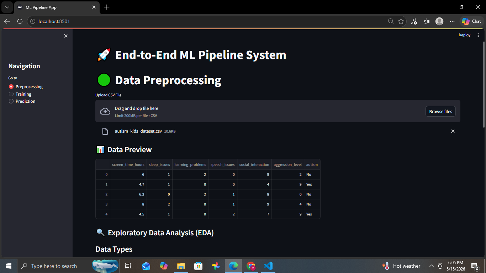
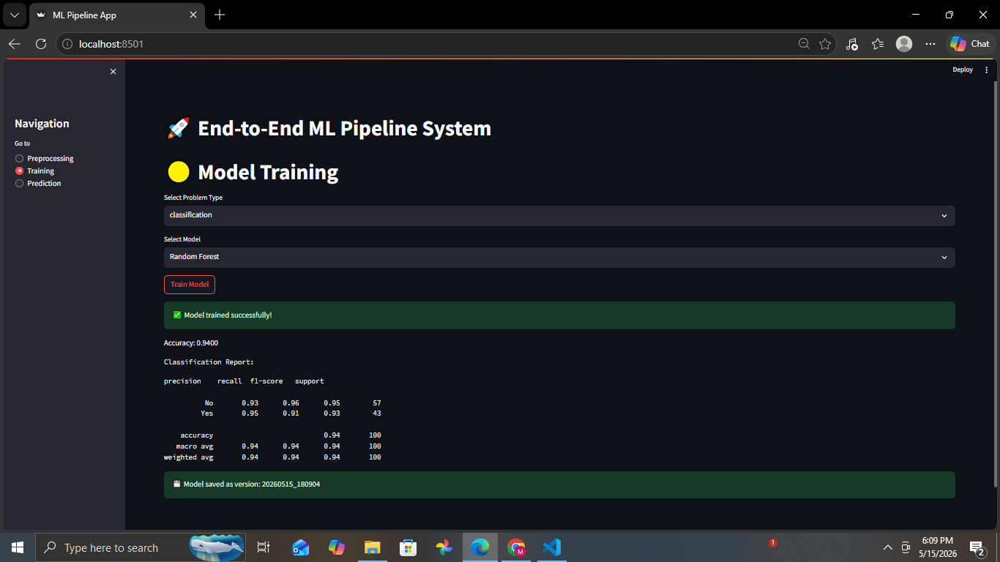
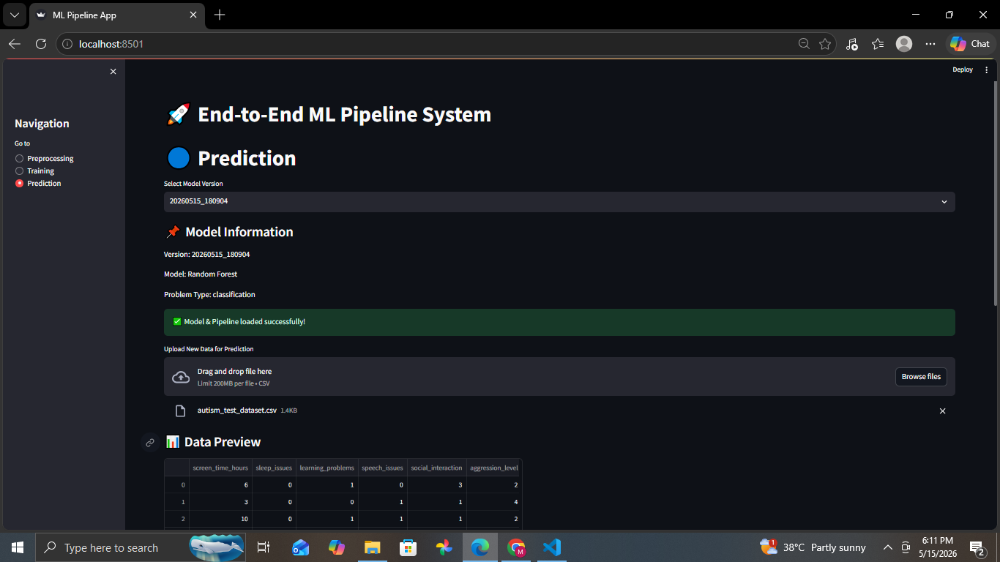

# ml-production-system
End-to-End Modular Machine Learning System (Preprocessing, Training, Prediction, Versioning)
# 🚀 End-to-End Modular Machine Learning System

A production-oriented machine learning system designed to handle the complete ML lifecycle — from preprocessing to model training, versioning, and prediction.

---

## 🧠 Key Capabilities

### 🟢 Data Preprocessing Module

* CSV Upload & Data Preview
* Exploratory Data Analysis (EDA)
* Missing Value Handling (Mean / Median / Mode)
* Outlier Detection (IQR Method)
* Categorical Encoding (One-Hot)
* Feature Scaling (StandardScaler, MinMaxScaler)
* Feature Selection (Correlation-based)
* Automatic Column Detection
* Train/Test Split (correct ML practice)
* Sklearn Pipeline (ColumnTransformer)

---

### 🟡 Model Training Module

* Classification & Regression Support
* Multiple Models:

  * Logistic Regression
  * Random Forest
  * Decision Tree
  * Linear Regression
* Model Evaluation:

  * Accuracy
  * Classification Report
  * MSE
  * R² Score

---

### 🔵 Prediction Module

* Load Saved Models
* Upload New Dataset
* Automatic Preprocessing (pipeline reuse)
* Input Validation (column matching)
* Predictions Generation
* Download Results (CSV)

---

### 🟣 Model Versioning System ⭐

* Automatic Version Creation (timestamp-based)
* Multiple Model Storage
* Metadata Tracking:

  * Version
  * Model Type
  * Dataset Name
  * Performance Metrics

---

### 📊 Model Comparison Dashboard

* Compare Multiple Models
* Accuracy / R² / MSE Visualization
* Performance Tracking

---

## 🏗️ Architecture

Modular and scalable system design:

UI Layer
↓
Service Layer
↓
Pipeline Layer
↓
Model Layer
↓
Versioned Storage

---

## 📸 Screenshots

### 🔹 Preprocessing

### 🔹 Training

### 🔹 Prediction

### 🔹 Dashboard

---

## 🎥 Demo

(Add your video or link here)

---

## ⚙️ Tech Stack

* Python
* Scikit-learn
* Streamlit
* Pandas / NumPy

---

## 💼 Service Model

This system is designed as a **service-based ML solution**:

* Clients provide datasets
* Processing, training, and prediction handled by developer
* Results delivered as outputs

---

## 📌 Note

This repository showcases system design and workflow.

Core implementation details and advanced logic are not publicly exposed.

---

## 📬 Contact

Available for freelance machine learning projects.

---

Mehreen — AI Innovator

